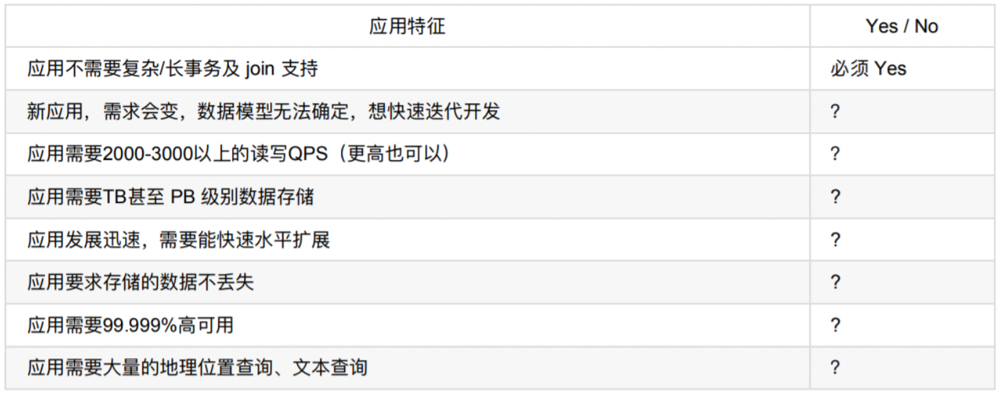
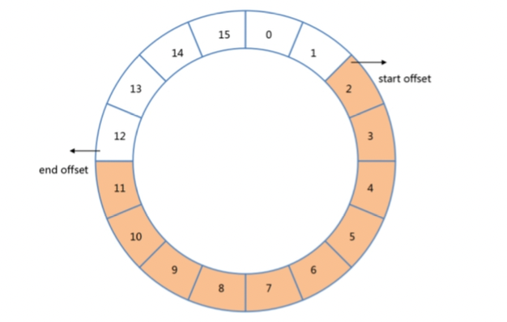
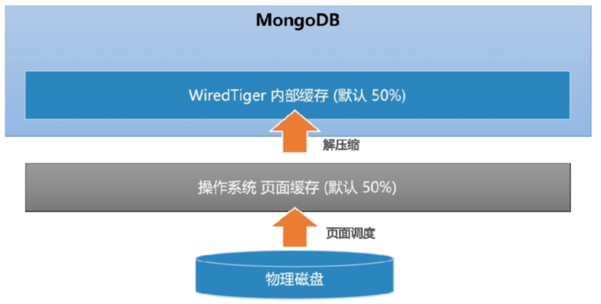

# mongodb

> 奇数个数的节点？

## 1. 基本知识

### 1.1 概述

是一个文档数据库，为web应用提供可扩展的高性能数据库存储解决方案。

可以延迟备份。

复制集中最多50个节点，最多7个节点参与集群选举。

高性能：

写性能：分片扩展

读性能：复制集可以分担读压力

目前复制集相对分片集用的更多。

类比于mysql，其中的db、table、索引、行、列、主键、表连接都存在对应的实现。

这两个一定分析清楚，有理有据

**优势：**

文档格式灵活多变

json结构和对象模型接近

复制集分担读压力

分片架构方便支持扩展

**劣势：**

早期不支持事务

启动时默认吃掉一半内存

选型方式

### 1.2 基础操作

**插入**

insertOne

支持writeConcern，类似raft协议中的两阶段提交，一定程度上可以防止数据丢失以及脑裂的情况。

同时支持通过journal控制是否直接写入磁盘

insertMany

同时可以通过js批量导入多条数据

**查询**

包括查询条件和投影两个条件

查询条件即表示要查询哪些行

投影即表示要查询哪些列

同样可以分页，用了skip、limit的方式，底层和mysql类似，会扫描skip+limit行数据，之后舍弃前skip行，所以对比较靠后的页不是太友好

**更新**

mongo集群模式下，数据同步是slave主动拉的，writeconcern机制中，也是主节点被动等待slave的确认。

默认情况下：

如果没有匹配到数据，即返回，但是可以设置为插入新的记录

默认只更新查到的第一条记录，如果有更新所有的需求，可以使用updatemany操作

更新操作中，基于copyonwrite的机制来做，更新的时候，首先到操作系统的page cache，之后在恰当时间写入磁盘。

### 1.3 基本结构

文档设计：

避免使用太长的字段名，对索引结构不是太友好

update的时候只包括需要更新的字段

尽可能使用批量插入来提升写入性能

可以使用ttl自动过期日志类型，这个可以在建表的时候指定

mongo内部数据结构

使用bson存放，我们直接操作数据库，交互使用的是json格式的数据，但是底层使用的是bson，结构和json类似

- 更高效的遍历
- 更丰富的数据类型

每一个document默认会有一个_id字段，这个默认是由客户端生成的，默认结构如下

时间戳+机器码+自增id，这个结构类似于雪花算法。

内嵌文档

文档的结构真的是可以非常灵活，中间可以内嵌文档，这个可以类比关系数据库中的不同表之间的关系

同时天然可以存放动态内嵌文档，例如，集合中存放多种商品，商品会有一个属性tags，即每个商品都会有一些属性，例如手机会有cpu 内存衣服会有尺码 颜色等，所以不同商品的tag就可以是不同的，灵活多变的，这种放在mysql不会这么灵活，大概率会搞几个表。

数组

**固定集合**

创建集合的时候，可以把它配置成固定的，即文档写入的时候，会写入尾部，同时这是一个环状的结构，意思就是后面会覆盖前面的数据，如下：

创建的时候，会有如下属性，

- capped

  是否为固定集合

- size

  每个文档的最大大小

- max

  集合的容量

这种结构是顺序读写的，即构建集合的时候，空间就已经申请下来了，申请之后，集合容量就不能再变了，不能删除数据，同时对数据做更新的时候，不能改变原有数据大小，同时它是不支持事务的。

用途

比较适合存放一些临时态的对象，例如系统日志、最新文档排名

### 1.5 存储引擎

类似于mysql，同样采用可插拔的存储引擎，目前用的比较多的是wiretiger

写入数据的时候，会对数据做**压缩**，节省磁盘空间，构建了2级索引的架构：

如上图，为了提升读写性能，wiretiger默认会占用一半的内存，索引的结构是b+树，做update操作的时候采取的是copy on write的机制，即复制出一块新的内存，在它上面做更新，之后替换原有内存，wiretiger每60s通过checkpoint机制刷一次盘，这么整如果宕机，大概率会丢数据，所以有了另一种持久化方式——journal日志，是每次有更新命令就刷到jounal缓存中，之后默认每100ms刷一次硬盘，相对于wiretiger的随机写入，journal是顺序写入，效率更高，所以可以做到刷盘频率更大。但是，数据还是会有概率丢失的。此外，如果journal日志达到100m，或者更新命令指定journal为true，即立刻触发journal日志持久化。

结合这两种持久化方式，如果系统发生宕机，首先会恢复到上一个检查点，之后结合journal日志重放，恢复数据。