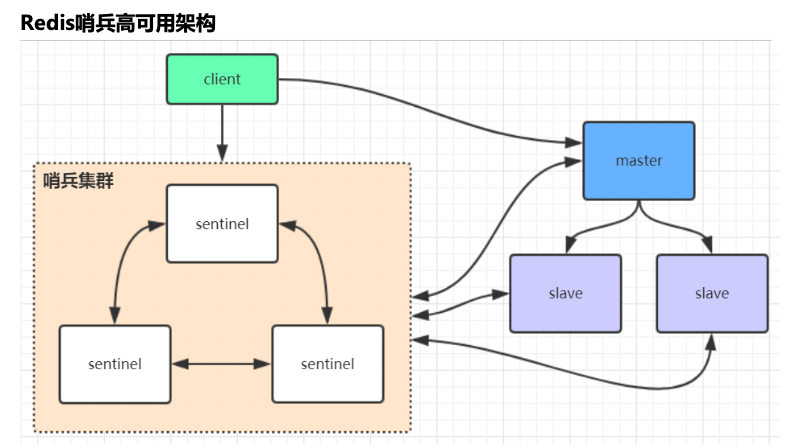
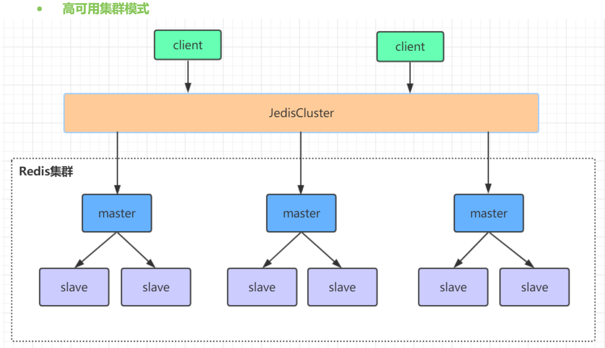
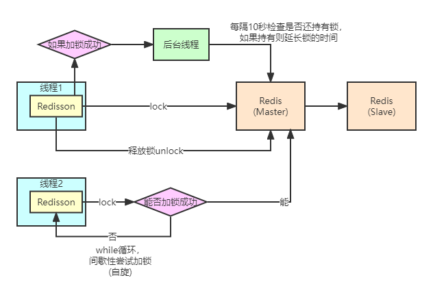
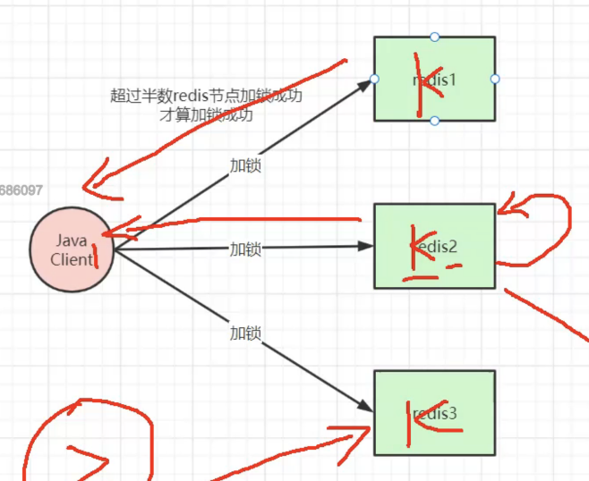

# redis

## 1. 常用数据结构

https://www.modb.pro/db/71948 要看下这里，看下数据结构的底层实现

key可以是字符串、整型、浮点型

| 数据类型 | 底层实现        |
| -------- | --------------- |
| string   | Sds             |
| hash     | Zipset hashmap  |
| list     | quicklist       |
| set      | intset hashmap  |
| zset     | zipset skiplist |


### 1.1 string

**基本操作**

常用命令 

- set 

- get 

  spring session就是利用redis的string来存的

- del 

- setnx 

  分布式锁使用的命令

- mset 

- mget

- incr

  原子性+1，类似于juc的atomic机制

  场景：

  统计阅读量

  批量生成序列号

- decr

  原子性-1

通用增删改查

过期时间设置：setex

原子性设置：setnx，如存在即设置失败

原子性加减：incr、decr、incrby、decrby

批量设置 mset mget

bit相关操作

**底层实现**

redis中key都是string类型，在redis服务端是使用simple dynamic string(SDS)接受的。

结构如下

```shell
sds:
	len: 7
	char buf[]="xxx\0xxx"
	free:0
```

是一种二进制安全的数据结构

会冗余分配


### 1.2 hash

常用命令

- 增删改查

  hset

  hsetnx 同string中的操作，如存在返回0，不存在设置并返回1

  hdel 删除某个hash中的key值

  Hget

  hmget

  hkeys 得到所有field

  hvals 返回所有value

  hexists 查看是否存在某个field

  Hrandfield 随机返回一个hash中的field，参数可以控制返回几个field，是否返回对应的value

  hincrby 某个field加给定值

  hincrbyfloat 某个field加给定小数

  hscan 类似scan的方式查找hash中的field，使用方式是hscan key cursor match pattern count n，这里cursor和存放数据的slot有一定关系todo

  

是一个 key -> value 的结构，其中value同样是key-value的结构

不同于string，hash的value也是一系列key-value的对，对于其中value的操作类似于string的操作，同样可以做原子加减

**场景**

对象缓存，存放对象的不同字段，如果key比较大，redis会比较麻烦

**优点**

相对string ，数据管理更紧凑，存储空间、性能方面更优

**缺点**

过期功能只能用到key中，不能用到field中

集群架构下不适合大规模使用？

### 1.3 列表list

**常用操作**

lpush

rpush

lpop

rpop

blpop

brpop

Lmove 在两个list之间移动元素

linsert 向list中指定位置插入元素

llen 长度

lpushx 只有当list存在才添加元素

lrem 删除一定数量的元素

ltrim 截取list

使用这些基本命令可以实现队列、栈以及阻塞队列、阻塞栈的形式。

常用的场景，例如消息队列

todo消息队列实现方式，自己是这么想的

消费者要订阅消息，可以这么定义list的key，topic-consumer，有消息，就把消息push进去，消费者可以使用blpop类似的命令持续监听队列，这种是推的模式。

还可以采用拉的方式，消息放在一个list中，订阅者主动去拉其中的消息，如果拉取的人太多，感觉可以考虑多放几个key，把压力分散出去，就是对于微博的大v，首先对他们来说，主动推不是太现实，粉丝太多了，可以把消息发布到几个key中，粉丝基于一定路由访问这些key，做负载均衡的方式。

### 1.4 集合 set

常用操作

sadd增

smembers查

srandmember随机查

spop删

scard查数量

sismember

sinter 交集

sunion 并集

sdiff 差集

具体的实现思路类似于java中的hashmap，其中求集合关系的功能在关系运算之间用的比较多。

基于这些操作实现关注列表的操作，利用关注集合的交并差计算两个人之间的关注关系。

可以利用set实现随机抽取的操作，srandmember和spop都是随机抽取元素的操作，不同的是前者会把元素放回去，后者会删除对应的元素。

感觉smismember有点意思，即批量判断给定的元素是否在集合中出现，就是不知道这种执行效率怎么样，我理解的话应该还可以。

### 1.5 有序集合 zset

常用操作

zadd 增

zincrby 改

zrevrange 倒序排序

zunionstore 求并集，并存储结果

和set类似，但是有一个元素score，看起来就像是只有一个field的hash结构，利用这个score，可以实现排序的功能。

是有序的，每个元素带一个分值，一个类似的功能，新闻热搜可以使用这种思路简单实现。

### 1.6 功能总结

看起来是都会有一些统一的功能，例如对于数值型的类型，会有类似原子增，string、hash、zset都会有类似的功能。

对于set类型，会有类似集合的操作，相关的集合操作包括交集、并集、差集，同时支持把结果存入新的数据结构。

之后，会有一些通用的命令：

- keys

  模糊搜索所有满足条件表达式的key，数据量比较大的话，是一个极为耗时的操作，不建议在生产使用

- scan

  弥补keys的问题，可以按批搜索所有的key值，每次搜索一批

- info

  查看redis服务信息

## 2. redis线程模型

**是单线程的吗**

这里单线程是指接受网络请求以及键值对读取分别都是由一个线程完成（？所以说是两个线程对吗todo），网络io不会因为某一个请求卡住而不能接受其他请求，同时因为全程在内存中操作，键值读取不会太慢。除此之外，redis中其他功能，例如持久化、异步删除、集群数据同步等，都是由额外的线程完成的。

**为什么性能好**

所有数据都是在内存中存放，不存在线程切换的损耗，同时，耗时的指令要慎用，因为花时间在这个指令上，意味着其他指令不能及时执行。

**怎么处理大量客户端连接**

这里简单看下redis中的服务器模型，核心有两个，io多路复用器以及事件处理器，io多路复用器接收client请求，之后将任务分发给事件处理器，看起来事件处理器是串行处理的任务。redis之后的升级，引入了异步删除以及多线程io读取的特性，以充分利用多核的性能。所以事件处理器还是单线程的，但是网络io在6.0之后就可以采用多线程的方式来做了。

## 3. redis数据持久化

> 集群模式搭建
>
> redis-cli --cluster create --cluster-replicas 1 127.0.0.1:7011 127.0.0.1:7012 127.0.0.1:7013 127.0.0.1:7014 127.0.0.1:7015 127.0.0.1:7016
>
> cluster-replicas配置了主从复值比

正常生产环境的redis还是要做持久化的，正常的持久化模式有两种，rdb和aof

### 3.1 rdb快照

备份当前的内存的快照，配置开启方式如下：

```shell
save 3600 1
save 300 100
save 60 10000
```

类似于这种方式，如果在配置的时间段内有多少操作，即触发rdb备份，如上，可以设置多个条件。

执行rdb快照有两种方式：

- save

  和正常的redis命令相同，如果当前内存中数据较多，会影响redis中其他命令正常执行。

- bgsave

  为了不影响正常redis命令执行，使用异步多方式做备份，采用copy on write的方式来做备份，步骤如下：

  1. fork一个子进程开启备份，子进程可以共享主线程的所有内存数据
  2. 正常如果备份的时候没有修改操作，即直接备份
  3. 如果对某块内存有修改操作，即复制一块同样的内存空间，之后子进程备份复制出来的内存，主线程在原有内存空间继续做写入操作。

相对于save，bgsave不会阻塞redis其他命令，但是会有一定的内存消耗。

### 3.2 aof备份

> rdb快照这种模式中，考虑到对性能的影响，save逻辑不会配置的特别频繁，所以如果redis宕机，很有可能会有数据没有来得及持久化，append only file(aof)一定程度上可以解决这些问题。

aof的逻辑中，只要执行了redis修改命令，即记录到缓存中，之后在特定的时机写入aof文件中，执行时机有以下几种：

- appendfsync always

  每次有命令执行，即写入aof

- appendfsync everysec

  每秒进行一次aof写入

- appendfsync no

  不主动发起aof备份，交给系统决定是否开启aof

相对于rdb，aof默认的配置，最多会丢失1s内写入的数据，aof是追加新增的命令，而rdb是备份整个内存，肯定是aof会快一些。之后，重启的时候，redis即基于aof文件恢复数据，是一种重放的方式。

aof缺点很明显，日志文件会比较大，同时如果redis存的数据较多，恢复速度会比较慢。针对日志文件大的问题，aof会在一定的时机会重写其中的命令，即将原本多条命令整合成一条等效的命令，具体时机如下：

- aof超过一定大小，即自动重写，默认64m
- 如果aof文件增加了一倍，且超过了阈值，开启重写

### 3.3 混合备份

rdb和aof各有优劣，其中rdb备份相对于aof更慢，丢数据的概率更高，但是rdb数据格式更紧凑，占用空间小，恢复也更快。

|          | rdb  | aof  |
| -------- | ---- | ---- |
| 优先级   | 低   | 高   |
| 备份速度 | 慢   | 快   |
| 恢复速度 | 快   | 慢   |
| 占用空间 | 小   | 大   |
| 安全性   | 低   | 高   |

两种持久化方式本身不是冲突的，可以同时开启，redis重启的时候默认使用aof恢复数据，如果没有aof，即使用rdb。

**优化**

4.0之后，产生了一种**混合持久化**的方式，即在aof文件重写的时候，会先备份当前的内存快照文件，同时在备份期间的额外操作会以aof的方式追加到内存快照文件后。

恢复的时候，只会有少量的命令要重放，大量的工作即使用快照的方式恢复，提升了恢复速度，压缩了存储空间，同时也不至于丢失太多数据。同时，只有在触发重写的时候采用这种混合持久化方式，不至于太频繁。

## 4. redis高可用模式

### 4.1 哨兵模式

单纯的主从架构是全手动的模式，如果主节点挂了，就要人工参与了，针对这种场景，即有了哨兵模式。

哨兵模式下，客户端和服务端中间加了一个哨兵集群，其中维护了主从结构的信息，客户端从哨兵集群中得到主节点的链接信息，同时在哨兵那里注册了监听机制，一旦主节点挂了，哨兵会重新组织选举，这里的选举是哨兵选举，即每个哨兵给剩余存活的节点投票，并把新的主节点信息给予前面的监听机制通知给客户端。



哨兵使用redis-sentinel命令启动，使用的配置文件为sentinel.conf。其中的核心配置是：

```shell
sentinel monitor <master-name> <ip> <redis-port> <quorum>
```

其中quorum指的是有多少哨兵发现主节点挂了，才会开始新的选举，最好是n/2 + 1个，n是哨兵的数量，即半数以上，从这里看，哨兵数量最好配置成奇数，保证不会出现一半一半的情况。

<font color='red'>真的一辈子都配置不好docker中的 redis sentinel 难受，之后专心看集群吧，真的难受，还是之前这个配置，之后就生效了，是因为sentinel会主动修改slave的conf，导致主从结构失效了</font>

**哨兵选举**

当一个master服务器被某sentinel视为下线状态后，该sentinel会与其他sentinel协商选出sentinel的leader进 行故障转移工作。每个发现master服务器进入下线的sentinel都可以要求其他sentinel选自己为sentinel的 leader，选举是先到先得。同时每个sentinel每次选举都会自增配置纪元(选举周期)，每个纪元中只会选择一 个sentinel的leader。如果所有超过一半的sentinel选举某sentinel作为leader。之后该sentinel进行故障转移 操作，从存活的slave中选举出新的master，这个选举过程跟集群的master选举很类似。 哨兵集群只有一个哨兵节点，redis的主从也能正常运行以及选举master，如果master挂了，那唯一的那个哨 兵节点就是哨兵leader了，可以正常选举master。 不过为了高可用一般都推荐至少部署三个哨兵节点。为什么推荐奇数个哨兵节点原理跟集群奇数个master节点 类似。

### 4.2 集群模式

哨兵模式下：

如果主节点失效，之后依赖哨兵的投票，投票过程中，会有一段时间的服务不可用；

只有主节点对外提供服务，同时，只有一个节点提供服务，意味着为了存放更多的数据，单节点的内存会更大，持久化以及主从备份的压力也会更大。

所以，哨兵模式适用于访问量不大、期望存储空间不大、能容忍因为选举带来的短暂停顿的场景，但是，如果并发访问压力较大，数据较多的场景，哨兵就有点吃紧了，所以就有了集群模式。

集群模式中，将所有的key基于hash分散到多个节点，同时每个节点都会有备份的slave节点，即分成多个主从的小集群，结构如下：



因为做了类似分片的操作，将原来打到一个master节点的流量打到了多个节点上，同时虽然也会有短暂断连的停顿，但是分散到了多个节点，一个节点有问题，其他节点还是可以用。

这里可以用docker compose搭建redis集群，每个节点注意把集群模式打开，如果配置ip的话，记得在bind后面加上对应ip。

之后登陆了集群中的某台机器，使用cluster命令可以查看集群的状态信息，包括cluster info或者cluster nodes等。

----

集群模式下，虚拟出了16384个slot，翻译过来叫槽位，这些槽位均匀分布到初始化的主节点上，当要操作对应的key的时候，对key进行crc16运算，之后对16384取余数，得到要放到哪个槽位，之后进而对应到master节点。之后的操作只能在主节点进行，即便在从节点请求，也会重定向到对应主节点。

使用类似于jedis的客户端访问集群的时候，会在建立连接的时候把cluster nodes信息取出来，得到哪些master节点存哪些slot，之后对key做操作的时候，会首先自己算出来对应的key是哪个slot，之后基于slot得到要请求的节点信息，之后就请求该节点，如果位置是对的，就等待操作结果就ok了，如果slot被迁移到了其他节点，就会返回一个重定向信息，其中包含对应机器信息，之后就更新slot映射信息然后请求对应地址，之后不排除下一次还会要求被重定向，不可能一直重定向的，所以就是可以配置一个最大重定向地址。

-------

### 4.4 分布式一致性实现

> 对于一般的消息中间件，多数可以使用zk做分布式配置中心，做节点上下线管理，属于cp的架构，而redis使用gossip协议来同步集群信息，如其含义，即悄悄话，是一种ap的设计，能保证最终一致性，但是总是会有一段时间，集群中的节点信息不一致。

#### 4.4.1 **数据同步**

集群中，只有master能够写入数据，为了保证数据写入的安全性和防止脑裂，redis提供了一种确认机制，即一个master只有在有n个slave连接同时在m秒内和slave有联系的情况下才能写入数据，相对于zk的两次确认机制，这种算是很宽松的了，只要有slave就可以，并没有强制要求写入成功，而且zk中是要求半数以上的节点写入成功才行，redis使用的是min‐replicas‐to‐write以及min-replicas-max-lag这两个参数，前者控制了有多少slave可以写入的阈值，后者控制了和slave通信间隔的阈值。

默认这种机制不会开启，有一定概率产生<font color='red'>脑裂</font>的情况，例如，在一个三个节点的小集群，有两个slave和一个master，master短暂发生了分区隔离，此时slave竞争新的master，经过投票，新的master产生，然而旧的master依旧也在提供服务，此时就有两个master提供服务，之后网络分区恢复了，旧的master回归集群，并成为了新master的slave节点，之后做的第一件事就是全量同步，导致之前存储的数据丢失。如果配置了min‐replicas‐to‐write以及min-replicas-max-lag参数，旧的master因为没有slave，就不会对外提供服务，防止了数据丢失。

-----

master、slave数据同步，在刚建立连接的时候，要做的是全量复制，即slave清空自己的内存，全量恢复master的内存快照，之后如果发生短暂断联可以通过断点同步恢复数据，即基于offset传递没有同步的数据，具体如下：

**全量同步**：

1. 使用psync命令同步数据，发送命令之前会跟主节点建立socker长连接
2. 主节点收到psync命令之后，执行bgsave生成rdb快照
3. 快照文件生成之后，向slave发送rdb快照文件
4. slave收到文件之后，会清空旧数据，之后加载新的rdb文件
5. 在生成rdb文件以及发送rdb文件的过程中，也会有写入命令，所以主节点会把repl buffer中的命令发送给从节点
6. 从节点执行收到的命令，写入到内存
7. 之后主节点每次执行更新命令，就通过socker长连接通知到从节点

如果从节点短暂断开，之后重新连接到主节点，会请求主节点开始断点续传的步骤，即master会创建一个和slave同步数据的缓存队列，master和它的所有slave都维护了master进程的id以及缓存队列的下标offset，之后slave断开了，会请求master同步数据，如果发现mater进程id变了或者slave的offset已经不在缓存队列中了，就转换为全量复制，如果还在，master就只把offset之后的命令同步给slave，这就是**断点续传**的机制。

同时为了避免主节点下直接连接的从节点过多，可以考虑从节点也分下层次，即有的从节点从其他从节点同步数据。

---

之后稳定建立连接，master和slave之间通过心跳同步数据。

**集群信息同步**

集群模式下，节点之间是通过gossip协议相互通信的，通信端口是正常端口+10000。通信协议有几种类型：

- meet

  集群中的某个节点发送集群信息给新加入的节点，之后新节点就开始和集群中其他节点通信

- ping

  每个节点都会频繁给其他节点发送ping，其中包括自己的状态以及维护的集群信息，互相通过ping交换集群信息，这里集群信息会有一个版本的概念，版本越大，就越新，新的集群信息会覆盖旧的集群信息。一般经过一轮选举，版本就会加1.

- pong

  对ping和meet消息的回复。

- fail

  某个节点判断另一个节点宕机之后，即发送fail信息给其他节点，通知他们有节点宕机。 当一个节点超过一定时间没有回复，即认为它宕机了，是由cluster-node-timeout控制，一般生产要配置下，实际情况下，网络抖动很可能会发生，不能说抖动导致的短暂失联马上触发fail。

#### 4.4.2 **崩溃选举**

当集群中slave发现自己的master挂掉了，便会尝试进行选举，以成为新的master，如果有多个slave，那么就竞争一下，具体流程如下：

1. slave发现master挂掉了，即向其他节点发送fail通知
2. 之后，将自己的currentEpoch加1，即将自己的集群信息版本号加1，之后延迟一定时间发起选举，延迟时间有一定随机性，同时也和slave自己保存的数据量成反比
3. slave广播FAILOVER_AUTH_REQUEST消息，即发起选举，
4. 只有master会响应广播消息，每个master只会给自己第一次收到的选举请求的slave回复，即投票
5. 如果有哪个slave获得了半数以上master支持，即成为新的master，并广播消息，通知其他节点，这里广播的消息中集群版本大，故其他收到消息的节点会更新自己的集群信息
6. 如果几个slave获取的选票相同，即等待下一轮选举

**关于选举延迟**

这里选举过程中，master收到选举请求之后即投票，所以发起选举请求越早，被选上的可能性就越大，同时要尽量避免slave同时发起选举，要有个随机性，尽量保证一次选出新的master，且保证数据更新的slave有更大的概率获选，基于此，对每个slave，发起选举的延迟时间公式如下：

```shell
DELAY = 500ms + random(0 ~ 500ms) + SLAVE_RANK * 1000ms
```

这里SLAVE_RANK和slave存放数据的新旧成反比，即slave数据越新，SLAVE_RANK越小，发起选举时间就越早。

**关于选票统计**

只有slave获得了半数以上master的选票，才算选举成功，这里半数是以正常master的数量算的，所以master节点个数必须至少是3个，如果是两个master，其中一个master挂了，之后永远选举不成功，因为对于2来说，半数以上意味着要有两个master赞成，所以不合适。

同时，还提倡master最好是奇数个，意思是对于2n+1和2n+2这两个数量的master节点的集群而言，对断联master节点的数量的容忍度是相同的，例如3和4，都只能容忍1个节点挂掉，5和6，7和8，同样的道理，但是master节点多了，流量压力肯定就下来了，所以也不一定要是奇数的，只是一种约定而已。

**关于选举过程中**

redis可以控制在集群不完整的时候，是否对外提供服务，默认应该是不会提供服务的。参数是cluster-require-full-coverage

## 5. redis命令执行

### 5.1 管道命令

jedis提供了一种管道的机制，即一次发送多个命令，服务端收到管道发送来的请求之后，依次执行这些命令，并一次返回执行结果。管道命令没有原子性，同时也没有事务机制，执行代码如下。

```java
try(Jedis resource = jedisPool.getResource()) {
    final Pipeline pipelined = resource.pipelined();
    for (int i = 0; i < 10; i++) {
        pipelined.incr("pipelinekey");
        pipelined.set("sgw" + i, "sgw");
    }
    final List<Object> objects = pipelined.syncAndReturnAll();
    objects.forEach(System.out::println);
}
```

使用管道命令可以减少网络请求的时间，一次请求多条命令，服务端执行完所有命令之后，一次返回所有执行结果。但是，这样势必会占用服务端更多的内存空间，是一个辩证的过程。

### 5.2 lua脚本

相对于没有原子性的管道而言，lua脚本是支持原子性以及事务的。即一段lua脚本的操作，redis server端是当作一条命令执行的，且具备原子性，天然支持事务，比较安全。

|                          | 管道 | lua脚本 |
| ------------------------ | ---- | ------- |
| 原子性                   | 否   | 是      |
| 事务                     | 否   | 是      |
| 是否可以穿插执行其他命令 | 是   | 否      |


### 5.3 批量命令

对于redis中的m开头的批量命令，如mset，集群模式，只有当所有的key都在同一个slot下，才能执行，否则直接返回失败，所以redis提供了一种机制，在key的前缀添加{pre-key}，之后redis即只会针对pre-key计算slot，所以想要强制一批key在同一个slot，可以采用这种方式。

## 6. 分布式锁

单机情况下，直接用用sync或者aqs提供的锁就可以hold住大部分并发场景，但是对于分布式场景，单纯的使用jdk中的锁就不太行了，因为它们不太可能跨jvm操作。但是可以在分布式场景下模拟加锁操作，核心逻辑就是维护一个分布式共享的内存，之后所有想要做加锁操作的实例，都在共享的内存中竞争操作，redis集群就是一个比较合适的工具。

### 6.1 **示例**

**场景**

多个实例并行，在redis中执行递减操作，减到0，就停止，如没有分布式协调操作，分布式压力较大的时候，大概率会减到0以下，因为会有多个实例发现value为1，之后执行递减，久减到了0以下。

**解决方案**

使用setnx加锁，使用完毕之后，删除key解锁。

**问题1**

加锁没有租期，系统宕机，导致死锁

解决方案：配置ttl

**问题2**

可能线程执行时间超过租期，之后锁自动放开，其他实例就可以获取锁，但是当前线程仍然会在执行完毕之后删除key，释放锁，但是这把锁不是自己加的，就有问题了。

解决方案：锁的key配置为对应clientid，解锁的时候判断加锁的对象是否是自己，是的话，即解锁

**问题3**

使用上述解决方案时，删除锁的过程不能保证原子性，即可能判断的时候还没过期，判断完即过期了，此时释放的锁就是其他实例获取的了，同样会复现问题2中的错误场景。

### 6.2 redisson的解决方案

> 针对上述问题，已经有比较成熟的解决方案了，例如redisson，redisson在加锁解锁的过程中或多或少地使用到了上面解决方案中的思路。首先要讲一个核心的点，就是redis脚本，即一段lua代码，其中可以包括多个redis操作，和redis的管道命令类似，可以一次执行多个命令，不过它比较独特的地方在于在执行lua脚本中的命令时，不会被打断，同时脚本整体具有原子性，是有事务保证的，所以6.1中提出的因为不能保证原子性导致的问题就可以使用lua脚本来解决。

redisson解决方案：

1. 首先，集群中某个实例的某个线程要通过redisson获取锁，会使用lua脚本执行一段核心的加锁逻辑，如下

   ```java
   <T> RFuture<T> tryLockInnerAsync(long waitTime, long leaseTime, TimeUnit unit, long threadId, RedisStrictCommand<T> command) {
       return evalWriteAsync(getRawName(), LongCodec.INSTANCE, command,
               "if (redis.call('exists', KEYS[1]) == 0) then " +
                       "redis.call('hincrby', KEYS[1], ARGV[2], 1); " +
                       "redis.call('pexpire', KEYS[1], ARGV[1]); " +
                       "return nil; " +
                       "end; " +
                       "if (redis.call('hexists', KEYS[1], ARGV[2]) == 1) then " +
                       "redis.call('hincrby', KEYS[1], ARGV[2], 1); " +
                       "redis.call('pexpire', KEYS[1], ARGV[1]); " +
                       "return nil; " +
                       "end; " +
                       "return redis.call('pttl', KEYS[1]);",
               Collections.singletonList(getRawName()), unit.toMillis(leaseTime), getLockName(threadId));
   }
   ```

   首先判断redis中是否存在锁对应的key，即这里的getRawName()，它是java代码中取锁对象的时候传入的字符串；

   1. 如果不存在，即在redis中构造一个锁对象，使用了hash来存储数据，其中只有一个fild，就是clientid+threadid，唯一标识获取锁的线程，value为1，用来标识重入次数，之后设置对象的存活时间，默认为30s，最后返回null。
   2. 如果锁已经存在，就判断当前锁是由谁持有的
      1. 如果是获取锁的线程，就把重入次数加1，之后返回null
      2. 如果不是当前线程持有的锁，就返回加锁的key的存活时间，用了ttl命令。

2. 这里如果获取了锁，外层就会使用类似watchdog的机制来不断给锁续命，默认10s一次，即在redis中查看锁是否还是本线程持有，如果是的话，就把锁对象的存活时间再次设置为30，防止锁失效。

3. 如果获取锁失败，就会使用类似自旋的机制不断尝试获取锁，每次自旋中间，都会基于查询到的锁对象的存活时间阻塞一定时间，这里阻塞是基于信号量来实现的，即juc中的semaphore，会调用它的tryAcquire方法，同时传入等待时间，等待时间即前面得到的ttl。这里的信号量初始化信号为0，所以，如果不加干涉，那么肯定会阻塞给定时间，之后再次尝试获取锁；
4. 获取锁失败的时候，其实会监听一个释放锁信息的消息队列，如果获得锁的线程执行完毕，主动释放锁，那么阻塞等待的线程就可以马上开始竞争获取锁了，中间会有一个唤醒的机制，就是通过消息队列实现的，释放锁的时候，同样会执行一段lua脚本，其中发现锁已经释放的时候，就会发布释放锁的消息，之后阻塞的线程监听到消息之后，就调用信号量的release方法，唤醒阻塞的线程，竞争获取锁。

<font color='red'>集群模式下调用lua脚本，具体应该由哪个机器执行，看了下，是执行脚本之前，redisson会根据传入的key找到对应的slot，之后找到slot对应的服务端地址，之后调用远程服务端，如果随机使用服务端执行，我想的话，肯定是有很明显的并发问题了，但是这里利用了一个redis节点上的任务执行器就是一个单线程来跑这一点来保证线程安全，即我只要执行之前确定好了哪个master来执行，那肯定是原子性的</font>

下面是笔记中给的分布式锁图片，基本是上述过程的简化版本：




看下trylock的逻辑

### 6.3 redis集群下的一些问题

如果加锁到master上之后，还没有来得及同步到slave，master挂了，之后slave选举成新的master，之后对于之前加锁的节点来说，它的锁就丢失了。

这种问题是因为数据没有在集群中大部分节点中存放，就给客户端返回写入成功。

zk作为分布式一致性中间件，对一致性保证的更好，底层基于zab协议实现，基于两阶段提交、崩溃选举保证了更好的一致性，但是牺牲了可用性。

redisson针对这种问题也有一些解决方案。红锁是其中的一个方案，采用了类似zk的两阶段提交的方案，提升了一致性，即使用多个redis客户端实现加锁，声明红锁的时候，只有其中半数以上的redis客户端加锁成功，才加锁成功，因为跨多个redis节点，原子性问题不能得到更好的保证，且一次加锁相当于之前几次加锁的时间，可能还不如zk，架构如下：



### 6.4 分布式锁的一些优化

**粒度**

锁的粒度越小越好

优化应用-分段锁，分散压力，例如秒杀场景，可以把原有的一个资源拆分成多个，把原有的资源竞争分散到多个资源。这里可以借鉴1.7的concurrenthashmap的实现。

## 7. 缓存实战架构

正常想到的架构，是数据库crud接口前，加上缓存处理。

- update

  更新cache

- insert

  插入cache

- select

  查询cache，不存在则更新

**问题**

高并发、大数据量场景下，如果所有信息都放cache，可能会有大量冷数据被放到cache，占用空间。

1. 数据放缓存，<font color='red'>记得配置过期时间，防止冷数据长期占用cache</font>
2. 对于热门数据，尽量让它在cache中多待一段时间，一种思路是没查一次就做下续命

以上实现了简单的冷热数据分离

-----

**缓存击穿(失效)**

如批量设置数据的过期时间，并且这些数据访问压力还不会太小，那么当数据在cache中过期，又有大量流量进来，这些请求会直接打到数据库，导致数据库压力过大。

同一批配置的超时时间，可以随机坐下调整，防止这些数据过期时间过于集中。

-----

**缓存穿透**

是指查询一些根本不存在的数据，请求直接打到缓存以及数据库，并且如果请求流量一直在，对cache和db的压力会一直都在。造成这种场景的问题可能是：

1. 后台正常数据被误删，导致正常流量不能得到正常响应
2. 大流量的恶意访问，穿透到服务端，把压力打到了cache和db

**方案1**

这里问题在于db中没有数据，之后不对cache做操作，就导致之后流量依旧会打到数据库，所以可以在发现db中确实没有数据，可以在cache中存一个空值，拦截针对不存在数据的请求。

但是，如果恶意流量每次请求的数据不一样，使用如上思路，cache中就会有大量空缓存，此时就是记得要设置过期时间。

**方案2**

布隆过滤器

过滤数据确定不存在的请求。

基本原理：

布隆过滤器是由几个hash运算器以及一个大的位数组构成。使用步骤即，向过滤器中添加key，使用几个hash运算器求hash，分别将位数组中对应hash位置的部分置1，这样之后查询该key是否存在，即使用同样步骤计算hash，分别查看位数组中是否存在这些hash。

这么设计可以保证查全率是100%，因为如果在位数组中有的hash是不存在的，那么可以100%确定该key是不存在的。

使用步骤：

在往数据库、缓存中插数据的时候，同时向布隆过滤器中插入该key，之后做查询的时候，首先在布隆过滤器中判断，过滤掉确定不存在的对象。这样就能一定程度上减少大量对不存在的key的查询造成的穿透，减少cache以及db的压力。

特性：

它是不能更新的，只能重新初始化。

------

**冷系统热启动**

突发大流量访问冷数据，cache不能cover，流量直接打到数据库。

**方案1**

**利用类似单例模式的思路，检测到缓存为空，就加锁，之后在锁里面判断如果为空，就建缓存，减小数据库的访问压力。**

要注意的是，

这里的锁要粒度适当，例如，不可能给所有场景都用一把锁，可以一部分商品用一部分锁对象来控制；

同时可以考虑使用基于redis的分布式锁来控制数据库的查询。

同时，可以考虑使用trylock获取锁，dcl中，第一重判断之后，如果大量线程竞争获取锁，之后就会出现大量线程等待获取锁的线程查数据库、写缓存，之后依次等待获取锁-查缓存-释放锁，到这一步就可以考虑串行转并行了，所以这里可以考虑使用trylock，含义就是我等待一段时间之后，认为怎么说缓存都已经构建好了，之后就不管是否能够获取锁了，直接去查缓存，就是经过一段时间之后，原来的串行转了并行，是否可以这么做以及等待的时间都是要商榷的，具体要看具体的场景，因为这么整会有一定概率因为读数据库、写缓存卡住了，确实缓存没数据，那么大量请求就又到了数据库，<font color='red'>是不是可以考虑在trylock下面再加一把兜底的锁，一旦转并行之后发现缓存还是没数据，就再转串行？</font>


<font color='red'>代码命名要规范，宁愿变量名称长一些，也要把含义讲清楚，尽量能做到见文知义</font>

-----

**缓存和数据库双写不一致的问题？**

查数据库与写缓存没有原子性，多个实例的多个线程并发执行查数据库、更新缓存以及写数据库、更新缓存的操作，不加以控制，很可能就会出现缓存中数据不是最新的问题。

**方案1**

对并发量小的场景、对不一致容忍度小的场景，通过给缓存加过期时间，错误的缓存会过期，保证最终一致性。

**方案2**

借助锁实现串行化。

就要保证查数据库+写缓存的原子性，一种方案是加锁，即在查询数据库前加锁，保证之后的更新缓存不会被打断。要保证在分布式环境下数据库操作及之后的缓存更新操作是满足一定的因果关系，不然就乱套了。

到这里基本解了对冷系统的突发大流量访问以及访问过程中mysql、redis双写不一致的场景，还有一个点，就是如果场景是**读多写少的场景**，就可以考虑使用读写锁，这样性能就高了一点，但是可能还是会有写饥饿的问题，不过在这个场景下，感觉没啥意思，因为获取读锁前就已经在锁里面了，如果只考虑这一部分，到这里流量已经没有多少了。

**方案3**

监听数据库binlog，当发现更新操作，按照更新操作的顺序更新redis，这种就不会有顺序的问题了，阿里开源的**canel**就是这么做的。

-------

**redis请求过量的问题，缓存雪崩**

所谓雪崩，就是整条链路中，部分节点出现问题，阻塞请求，之后逐步导致整个服务的请求都被阻塞，拒绝服务。对于redis，假设当大量请求涌入服务器，到了查询redis的步骤，因为请求量过于大，导致阻塞时间过长，导致请求迟迟不能正常返回，服务器大量请求线程不能释放，最终导致请求线程池爆满，对外表现就是拒绝服务，产生雪崩。

大量请求涌入，同一个key，单节点的redis也扛不住的问题，这里想到了就是要分散一个key的压力，或者做限流操作。

**方案**

多级缓存，jvm本地缓存+redis+db，三级缓存，这里缓存可以使用guava这种缓存框架；

简单实现是在一个web实例中加jvm缓存，之后可以考虑多个实例之间通过mq共享缓存信息。

以上步骤是不是可以考虑把redis再封装一步，更新redis的时候，动态计算热点key，确定了热点key之后，动态更新节点中的本地缓存，这里就涉及了一套热点缓存系统，把计算热点缓存的逻辑抽离出来，由这套系统再去通知web节点更新本地缓存。

## 8. redis编程建议

**key名**

最好以业务名或者数据库名为前缀，防止key冲突，以冒号分隔，有可读性，但是最好不要太长。

**value**

value不要太大

为什么会有bigkey？

设计不当，例如对于社交类应用，粉丝列表放在一个key中，统计类应用，1天的统计数据放一个key中

一定要有？

考虑下怎么拆分，尽量避免一次读取过多数据，避免一次删除所有元素

要选择合适的数据类型

尽量设置超时时间

**连接池配置**

生产肯定是要用连接池来连接redis服务端

| 参数     | 解释                                           |
| -------- | ---------------------------------------------- |
| maxTotal | 最大连接数，和服务端建立的最大连接数           |
| maxIdle  | 最大空闲连接数，和服务端建立连接的最大空闲数量 |
| minIdle  | 最小空闲连接数，确保的最小连接数量             |

可以考虑maxTotal和maxIdle配置成相同的值，减小连接池的伸缩成本，用意和jvm的xms、xmx配置类似。具体的值和具体场景有关，例如业务方需求的qps，正常情况下一个client执行一次命令的平均消耗的时间，应用节点个数，redis服务端能够接受的最大连接数。

**预热**

为了提高系统刚启动时候的查询性能，可以做预热操作，例如促使连接池在业务请求过来之前创建好一定数量的连接。

**缓存过期策略**

- 被动删除

  当读写一个过期的key，会触发惰性删除

- 主动删除

  被动删除无法保证冷数据及时被删除，redis会定期主动淘汰一批过期的key

- 主动清理

  当前占用内存超过最大内存限制时，触发主动清理策略

**主动清理策略**

- 针对设置了过期时间的策略
  - 根据过期时间先后排序，越早过期的越早被删除
  - 随机删除
  - lru 基于使用时间做删除，优先删除更久没有使用的key
  - lfu 基于使用频率做删除，优先删除使用数量更少的key

- 针对所有的key处理
  - 随机挑选
  - lru
  - lfu

- 不处理 内存满了，不会删除任何数据，拒绝更新操作，接受读操作，默认策略。

大部分情况下，使用lru，对于主要存放热点数据的redis，使用lfu。

默认是没有配置最大内存的，没配置的话，就可能会撑爆内存。


一些思考

存储方案，数据存储，一般而言，就是给提供一个存取数据的接口，我们通过接口告诉数据库，有些数据要存一下，它们的名字是xx，之后我们想要查看这些数据的时候，就还是通过接口查找，告诉他，我之前存了一批数据，名称是xx，给我返回数据是啥。

基本流程是这样了，对于流程中的每一个点，就会有不同的实现方式：

**存储位置：**

磁盘：意味着存储的数据量级会比较大，但是，磁盘io的性能较差，意味着存取效率不会太高

内存：相较于磁盘，空间会比较小，存取速度较快，但是也存在机器断电，数据丢失的风险

基本是这两种存储方式，它们优点很明显，同时缺点也很明显。所以对于磁盘存储的方式而言，大多会采用索引的方式减少磁盘io次数，降低查询时间，同时对于内存存储的方式而言，大多会采取一定的数据持久化方案，保证数据安全。

更具体一些，目前磁盘数据库一般是mysql、mongo，内存数据库一般是redis、zk等，同时服务运行过程中的一些本地map也可以勉强算一层内存数据库。

**存储方式：**

结构化存储

mysql是一个典型的例子，即严格规定了一个表中的数据结构，存储的每一行都要按照格式来放

非结构化存储

mongodb、图数据库，这些没有严格限定数据结构

key-value形式

一些内存数据库一般会采用这种方式，redis、zk


